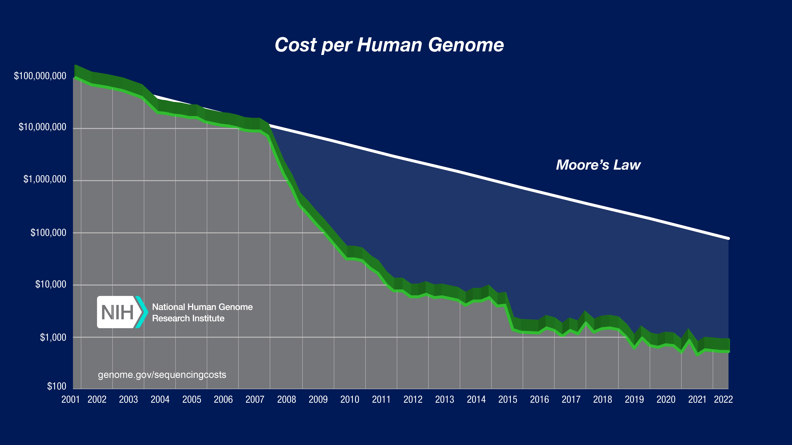

## Wednesday, May 1, 2024 MetaHipMer Meeting


## Admin

- Continue onboarding Gavin and Logan on Sandia systems
- **TODO:**
  - Amy ask Phyllis for help w/ accounts re-authorization
  - Logan:  find out if you can purchase / obtain "business" laptop
  - Team:  Consider if we want to run project like a true software project, with project board, issues, pull requests, similar to the Kokkos project?
  - Jan:  Get MS Teams fixed on your machine :smile:


## Scientific Community News / Meetings

- [Kokkos-Remote-Spaces](https://github.com/kokkos/kokkos-remote-spaces) V2 release is nigh ..
- **TODO:**
  - Plan to attend and contribute to [SC24](https://sc24.supercomputing.org/)

## Science / Engineering

- **TODO:**
  - Team:  figure out how to merge changes in, and how we want to manage the main repo?  Can we follow Kokkos' example for code and project management?
  - Team:  think about SC24 Abstract and poster
  - Team:  Continue focusing on exactly what’s happening in the initial events of kmer analysis for a single read set (i.e., not “paired end” reads), towards the goal of understanding (see output below):
    - How kmers (from a 100 base read, for instance) are made
    - How and where kmers are stored (local-to-a-node hash table?)
    - How is UPC++ distributed object formed from local hash tables (assuming that is what occurs …?)
    - Understand the purpose of the “extension” step
    - Understand why kmers (21, 33, 55, 77, 99)  of different sizes are used (see “#Histogram” below), and how these assemblies of kmers of various sizes relate to the overall assembly

  - Team:  Pre-view / play with [DHT mini app](https://github.com/ajpowelsnl/DHT)
  - Team:  Identify large datasets that we could use in scaling / perf study of app;
    - [JGI Lake Mendota Dataset](https://jgi.doe.gov/supercomputing-metahipmer-and-the-mega-dataset-of-lake-mendota/)
    - Others?
  - Amy: do alignment of CUDA vs. HIP assemblies -- they appear different 
  - Amy: continue developing profiling approach; involve Simon once there's a basic working example   


## How to Run mhm2 and Output on LLNL Lassen (IBM Power9 / NVIDIA V100)


```
# Environment (read: compilers)
 
[powell56@lassen32:upcxx]$ module list
 
Currently Loaded Modules:
  1) base-gcc/8.3.1       3) cmake/3.23.1   5) spectrum-mpi/rolling-release   7) nsight-compute/2023.2.2
  2) StdEnv         (S)   4) gcc/10.2.1     6) cuda/12.2.2                    8) git/2.31.1
 
  Where:
   S:  Module is Sticky, requires --force to unload or purge
 
 
 
# Build UPC++
 
../configure \
--with-cxx=mpicxx \
--with-cc=mpicc \
--with-nvcc=/usr/tce/packages/cuda/cuda-12.2.2/bin/nvcc \
--disable-pshm-posix \
--enable-pshm-sysv \
--disable-smp \
--enable-udp \
--enable-mpi \
--enable-cuda \
--with-default-network=ibv \
--enable-ibv \
--with-ibv-physmem-max=2/3 \
--enable-ibv-odp \
--enable-ibv-multirail \
--with-ibv-max-hcas=2 \
--with-ibv-ports="mlx5_0+mlx5_3" \
--disable-ibv-conn-thread \
--disable-ibv-rcv-thread \
--with-cxxflags=-std=c++17 \
--with-gasnet=https://bitbucket.org/berkeleylab/gasnet/downloads/GASNet-stable.tar.gz \
--prefix=/usr/workspace/prox_snl/upcxx_install_lassen_cuda_compute_gcc_10_cuda_12
 
 
 
# Basic case proxy build (i.e., Kokkos is not switched on; I will send a Kokkos build lesson tomorrow or so)
 
export KOKKOS_INSTALL=/usr/workspace/prox_snl/Kokkos/kokkos_install_lassen_gcc_10_2_1_cuda_12_2
export INSTALL_DIR=/usr/workspace/prox_snl/proxy_apps/mhm2_install_lassen_gcc_10_cuda_12
 
 
./build.sh \
Release \
"-DCMAKE_CXX_STANDARD=17 \
-DCMAKE_CXX_COMPILER=/usr/tce/packages/spectrum-mpi/spectrum-mpi-rolling-release-gcc-10.2.1/bin/mpicxx \
-DKokkos_ROOT=${KOKKOS_INSTALL} \
-DCMAKE_INSTALL_PREFIX=${INSTALL_DIR} \
-DENABLE_KOKKOS=OFF"
 
 
# Run mhm2 executable (again, Kokkos is NOT enabled)
 
export FORWARD_READS=/usr/workspace/prox_snl/assembler_input_datasets/gcc_profiling_small/36_S23_R1_001_trimF0_01.fastq
export REVERSE_READS=/usr/workspace/prox_snl/assembler_input_datasets/gcc_profiling_small/36_S23_R2_001_trimF0_01.fastq
export DATA_ROOT=/usr/workspace/prox_snl/assembler_input_datasets/gcc_profiling_small
export UPCXX_RUN=/usr/workspace/prox_snl/upcxx_install_lassen_cuda_compute_gcc_10_cuda_12/bin/upcxx-run
 
$UPCXX_RUN \
-N 2 \
-n 16 \
-shared-heap 200M \
-network=ibv \
-backtrace \
./mhm2 \
--pin=none \
--paired-reads \
$FORWARD_READS \
$REVERSE_READS \
-o \
/usr/workspace/prox_snl/proxy_apps/mhm2_proxy/kmer_results_laseen_gcc_10_CUDA_12
 
 
# Proxy OUTPUT (to STDOUT)
 
 
[powell56@lassen32:bin]$ ./run_kmer_exe_lassen_gcc_10_cuda12.sh
which: no lfs in (/usr/tce/packages/spectrum-mpi/ibm/spectrum-mpi-rolling-release/container/../bin:/usr/tce/packages/spectrum-mpi/ibm/spectrum-mpi-rolling-release/container/../bin:/usr/workspace/prox_snl/upcxx_install_lassen_cuda_compute_gcc_10_cuda_12/bin:/usr/workspace/prox_snl/upcxx_install_lassen_cuda_compute_gcc_10_cuda_12/bin:/usr/tce/packages/git/git-2.31.1/bin:/usr/tce/packages/nsight-compute/nsight-compute-2023.2.2:/usr/tce/packages/cuda/cuda-12.2.2/bin:/usr/tce/packages/spectrum-mpi/spectrum-mpi-rolling-release-gcc-10.2.1/bin:/usr/tce/packages/gcc/gcc-10.2.1/bin:/usr/tce/packages/cmake/cmake-3.23.1/bin:/usr/tcetmp/packages/base-gcc/base-gcc-8.3.1/bin:/usr/tcetmp/bin:/usr/lib64/qt-3.3/bin:/usr/condabin:/usr/local/bin:/usr/bin:/usr/local/sbin:/usr/sbin:/opt/ibm/spectrum_mpi/jsm_pmix/bin:/opt/ibm/bb/bin:/opt/ibm/flightlog/bin:/opt/ibutils/bin:/opt/ibm/spectrumcomputing/lsf/10.1.0.10/linux3.10-glibc2.17-ppc64le-csm/etc:/opt/ibm/spectrumcomputing/lsf/10.1.0.10/linux3.10-glibc2.17-ppc64le-csm/bin)
Using output dir: /usr/workspace/prox_snl/proxy_apps/mhm2_proxy/kmer_results_laseen_gcc_10_CUDA_12
MHM2 version 2.0.1.2.54f3601-dirty-towards_kokkos_2 with upcxx-utils 0.3.5 built on 20240410_142110
Options:
  paired-reads =           /usr/workspace/prox_snl/assembler_input_datasets/gcc_profiling_small/36_S23_R1_001_trimF0_01.fastq /usr/workspace/prox_snl/assembler_input_datasets/gcc_profiling_small/36_S23_R2_001_trimF0_01.fastq
  kmer-lens =              21 33 55 77 99
  scaff-kmer-lens =        99 33
  output =                 /usr/workspace/prox_snl/proxy_apps/mhm2_proxy/kmer_results_laseen_gcc_10_CUDA_12
  pin =                    none
_________________________
Starting run with 16 processes on 1 node at 04/10/24 14:31:48
Paired files /usr/workspace/prox_snl/assembler_input_datasets/gcc_profiling_small/36_S23_R1_001_trimF0_01.fastq and /usr/workspace/prox_snl/assembler_input_datasets/gcc_profiling_small/36_S23_R2_001_trimF0_01.fastq are 72.66MB and 72.70MB
Total size of 1 input file is 145.36MB
Initial free memory across all 1 nodes: 281.38GB (281.38GB avg, 281.38GB min, 281.38GB max)
Starting with 281.38GB free on node 0
 
Completed initialization  at 04/10/24 14:31:50 (277.67GB free memory on node 0)
_________________________
Contig generation k = 21
 
_________________________
Assembly statistics (contig lengths >= 500)
    Number of contigs:       3
    Total assembled length:  2158
    Average contig depth:    4.80516
    Number of Ns/100kbp:     0 (0)
    Max. contig length:      819
    Contig lengths:
        > 1kbp:              0 (0.00%)
        > 5kbp:              0 (0.00%)
        > 10kbp:             0 (0.00%)
        > 25kbp:             0 (0.00%)
        > 50kbp:             0 (0.00%)
 
Completed contig round k = 21 at 04/10/24 14:31:53 (273.94GB free memory on node 0)
_________________________
Contig generation k = 33
 
_________________________
Assembly statistics (contig lengths >= 500)
    Number of contigs:       6
    Total assembled length:  3843
    Average contig depth:    5.01835
    Number of Ns/100kbp:     0 (0)
    Max. contig length:      819
    Contig lengths:
        > 1kbp:              0 (0.00%)
        > 5kbp:              0 (0.00%)
        > 10kbp:             0 (0.00%)
        > 25kbp:             0 (0.00%)
        > 50kbp:             0 (0.00%)
 
Completed contig round k = 33 at 04/10/24 14:31:55 (273.61GB free memory on node 0)
_________________________
Contig generation k = 55
 
_________________________
Assembly statistics (contig lengths >= 500)
    Number of contigs:       7
    Total assembled length:  5056
    Average contig depth:    48.5317
    Number of Ns/100kbp:     0 (0)
    Max. contig length:      1168
    Contig lengths:
        > 1kbp:              1168 (23.10%)
        > 5kbp:              0 (0.00%)
        > 10kbp:             0 (0.00%)
        > 25kbp:             0 (0.00%)
        > 50kbp:             0 (0.00%)
 
Completed contig round k = 55 at 04/10/24 14:31:59 (273.63GB free memory on node 0)
_________________________
Contig generation k = 77
 
_________________________
Assembly statistics (contig lengths >= 500)
    Number of contigs:       8
    Total assembled length:  5891
    Average contig depth:    54.2068
    Number of Ns/100kbp:     0 (0)
    Max. contig length:      1493
    Contig lengths:
        > 1kbp:              1493 (25.34%)
        > 5kbp:              0 (0.00%)
        > 10kbp:             0 (0.00%)
        > 25kbp:             0 (0.00%)
        > 50kbp:             0 (0.00%)
 
Completed contig round k = 77 at 04/10/24 14:32:14 (273.62GB free memory on node 0)
_________________________
Contig generation k = 99
 
_________________________
Assembly statistics (contig lengths >= 500)
    Number of contigs:       8
    Total assembled length:  6536
    Average contig depth:    48.8364
    Number of Ns/100kbp:     0 (0)
    Max. contig length:      1492
    Contig lengths:
        > 1kbp:              2670 (40.85%)
        > 5kbp:              0 (0.00%)
        > 10kbp:             0 (0.00%)
        > 25kbp:             0 (0.00%)
        > 50kbp:             0 (0.00%)
 
Completed contig round k = 99 at 04/10/24 14:32:25 (273.52GB free memory on node 0)
_________________________
_________________________
Assembly statistics (contig lengths >= 500)
    Number of contigs:       8
    Total assembled length:  6536
    Average contig depth:    48.8364
    Number of Ns/100kbp:     0 (0)
    Max. contig length:      1492
    Contig lengths:
        > 1kbp:              2670 (40.85%)
        > 5kbp:              0 (0.00%)
        > 10kbp:             0 (0.00%)
        > 25kbp:             0 (0.00%)
        > 50kbp:             0 (0.00%)
 
Completed finalization at 04/10/24 14:32:25 (273.52GB free memory on node 0)
_________________________
Peak memory used across all 1 nodes: 12.05GB (12.05GB avg, 12.05GB min, 12.05GB max)
Finished at 04/10/24 14:32:25 for 2.0.1.2.54f3601-dirty
 
 
# Assembly
 
[powell56@lassen32:prox_snl]$ ls proxy_apps/mhm2_proxy/kmer_results_laseen_gcc_10_CUDA_12/
contigs-21.fasta  contigs-33.fasta  contigs-55.fasta  contigs-77.fasta  contigs-99.fasta  final_assembly.fasta  mhm2.config  mhm2.log  per_rank
 
# Histogram (voila!!)
 
[powell56@lassen32:prox_snl]$ grep -c ">" proxy_apps/mhm2_proxy/kmer_results_laseen_gcc_10_CUDA_12/contigs-21.fasta
375871
[powell56@lassen32:prox_snl]$ grep -c ">" proxy_apps/mhm2_proxy/kmer_results_laseen_gcc_10_CUDA_12/contigs-33.fasta
283286
[powell56@lassen32:prox_snl]$ grep -c ">" proxy_apps/mhm2_proxy/kmer_results_laseen_gcc_10_CUDA_12/contigs-55.fasta
170453
[powell56@lassen32:prox_snl]$ grep -c ">" proxy_apps/mhm2_proxy/kmer_results_laseen_gcc_10_CUDA_12/contigs-77.fasta
101530
[powell56@lassen32:prox_snl]$ grep -c ">" proxy_apps/mhm2_proxy/kmer_results_laseen_gcc_10_CUDA_12/contigs-99.fasta
55812
 

```

# Historical Context




